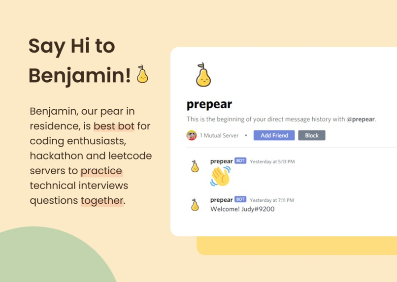
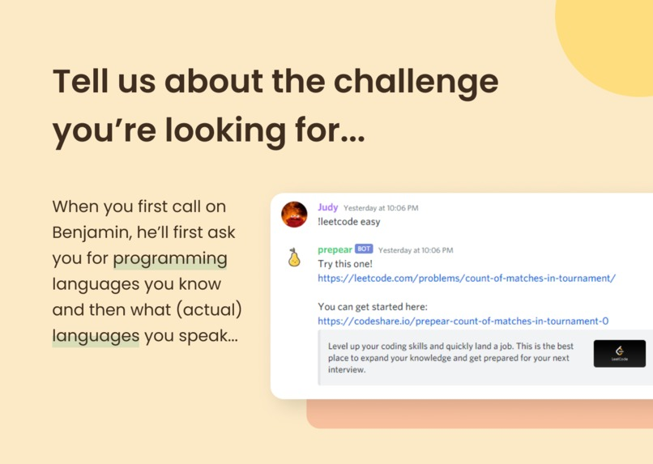
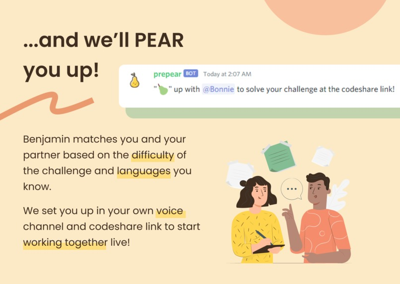

<p align="center>
          
  
  
</p>
                                                          
<div align="center">
                   
# prepear

</div>

### :beginner: About

Summer co-ops are closing in _fast_ and we're all applying for our first coop term! We're **super anxious** for the technical interviews, having never really done them before. This is especially given that quarantine has made it difficult to stay energized and to collaborate with those around us. And it seems that for the majority of students applying to jobs whether they are lacking in technical or communication skills. With prepear, you are able to **mimic the environment** of a technical interview. You are able to practice critical communication skills in **walking through your thought process** while improving your problem solving through tackling programming challenges.

prepear, run by our faithful pear, Benjamin, is a discord bot pairs programmers up, randomly generates a leetcode question and sends the programmers into a voice channel to tackle it together through live code sharing. You are paired up with another programming depending on the language you use and the difficulty of the question you would like to solve. Once a pair is generated, they are sent into a voice channel, given a link to leetcode and a link to codeshare.io where they can live collaborate.


### :electric_plug: Development Setup

This project is built using Discord.py and CockroachDB.

To try it out for yourself:

1. Clone this repository and `cd` into it.

   ```bash
   $ git clone git@github.com:gracewgao/prepear.git
   $ cd prepear
   ```


1. Create a new virtual environment.

   ```bash
   $ pip install virtualenv
   $ virtualenv venv
   ```
   
    - On Mac:

        ```bash
        source venv/bin/activate
        ```
   
   - On Windows:
    
        ```bash
        venv\Scripts\activate
        ```
   

1. Install the dependencies.

    ```bash
    pip install -r requirements.txt
    ```


1. Set up CockroachDB with psycopg2 with the instructions [here](https://www.cockroachlabs.com/docs/stable/build-a-python-app-with-cockroachdb.html)


1. Start the app and enter your Discord Bot token when prompted.

    ```bash
    python app.py
    Bot Token: <paste your token here>
    ```
    You can find your token by creating an application from the [Discord Developer Portal](https://discord.com/developers/applications)


1. Invite your Discord Bot to your server!
    
### Quick Preview
Here's a glimpse into what it looks like! <br /><br />




### Contributing
Please feel free report bugs and add any ideas you like!
